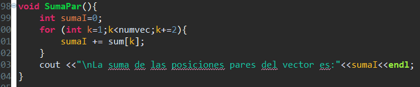

# Tarea Laboratorio 4 Programación Avanzada

### Carlos Andrés Cuéllar Velásquez 2497117
       
## a) Bitácora

1. Inicializar el programa.

   1.1 Se incluyen todas las librerias a utilizar. 
   1.2 Se hacen los prototipos de cada uno de los metodos a utilizar para poder escribirlos abajo del main.
   1.3 Se declaran las variables globales. 

 

 
2. Tabla de multiplicar.

   2.1 Se hace un arreglo de 11 posiciones con los numeros de 0 a 10.
   2.2 Se declaran las variables numlt e i; ambas de tipo int.
   2.3 Se crea un ciclo for donde i iniciara de 0 hasta que sea menor a 11.
   2.4 Dentro del ciclo for, se estara imprimiendo cada valor y su resultado de la multiplicacion de numlt con los numeros del arreglo.

3. Solicitar Vector.

   3.1 Se imprime el mensaje solicitando el largo del vector y se guarda en la variable global "numvec".
   3.2 Se crea el arreglo dinamico con una capacidad dada por el usuario.
   3.3 Se crea un ciclo for donde i iniciara de 0 hasta que sea menor al largo solicitado por el usuario.
   3.4 Dentro del ciclo for, se guardan todos los numeros ingresados dentro del arreglo.

4. Impresión Vector.

   4.1 Se crea un ciclo for donde i iniciara de 0 hasta que sea menor al largo solicitado por el usuario.
   4.2 Dentro del for se imprimi el vector previamente ingresado por el usuario.
   

5. Suma elementos del vector y Largo del vector. 

   5.1 Se declara la variable sumat.
   5.2 Se crea un ciclo for donde l iniciara de 0 hasta que sea menor al largo solicitado por el usuario.
   5.3 Dentro del ciclo se iran sumando los valores dentro de la variable sumaT.
   5.4 Se imprime la variable sumaT que contiene la suma de todos los elementos del vector.
   5.5 Se imprime la variable global numvec que tiene el largo del vector.   

6. Suma elementos pares del vector. 

   6.1 Se declara la variable sumaI.
   6.2 Se crea un ciclo for donde K iniciara de 1 hasta que sea menor al largo solicitado por el usuario e incrementara de 2 en 2.
   6.3 Dentro del ciclo se iran sumando los valores dentro de la variable sumaI.
   6.4 Se imprime la variable sumaI que contiene la suma de todos los elementos pares del vector.
  

